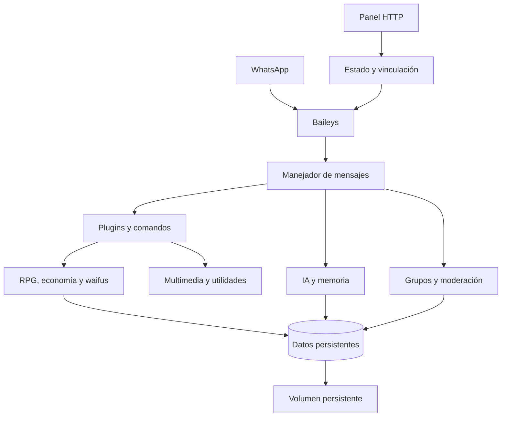

<div align="center">
  

  

  <p>
    
    
    
    
  </p>

  <p>
    <a href="#visión-general">Visión general</a> ·
    <a href="#inicio-rápido">Inicio rápido</a> ·
    <a href="#configuración">Configuración</a> ·
    <a href="#despliegue">Despliegue</a>
  </p>
</div>

---

## Visión general

**Kurumi Tokisaki - Bot** es un bot modular para WhatsApp construido con Node.js y Baileys. Integra conversación asistida por IA, economía y progreso RPG, colección de waifus, utilidades multimedia y controles para grupos. Su diseño separa los comandos en plugins, conserva los datos de forma persistente y ofrece un panel HTTP para consultar el estado de la conexión y gestionar la vinculación.

| Área | Capacidades principales |
|---|---|
| Conversación e IA | Respuesta contextual por mensaje privado, cita o mención; historial de conversaciones y herramientas internas. |
| RPG y economía | Perfiles, niveles, experiencia, monedas, inventario, clases, misiones y clasificaciones. |
| Waifus | Colección, afinidad, fusión, transferencia e interacciones asociadas al sistema de perfiles. |
| Multimedia | Comandos para stickers, imágenes, música, vídeo, búsquedas y otras utilidades. |
| Grupos | Bienvenida, despedida, moderación, controles administrativos, menciones y antilink. |
| Operación | Panel web de estado, código de vinculación, reconexión, limpieza de sesión y almacenamiento configurable. |

> **Persistencia recomendada.** La carpeta de sesión y la base de datos deben residir en un volumen persistente si el proveedor reinicia o vuelve a desplegar el proceso.

---

## Inicio rápido

El proyecto requiere **Node.js 20 o superior** y npm. Tras clonar el repositorio, instala las dependencias, crea tu archivo de configuración local e inicia el proceso.

```bash
# Clonar el repositorio
git clone https://github.com/Francisco50-Discord/Kurumi-Tokisaki-Bot.git
cd Kurumi-Tokisaki-Bot

# Instalar dependencias
npm install

# Crear la configuración local
cp .env.example .env

# Iniciar el bot
npm start
```

Al iniciarse, el proceso expone un panel HTTP en el puerto indicado por `PORT`. Desde ese panel puedes consultar el estado de conexión y solicitar un código de vinculación para el número configurado.

| Comando | Propósito |
|---|---|
| `npm start` | Inicia el bot mediante `entry.js` con la configuración de producción. |
| `npm run dev` | Inicia el punto de entrada de desarrollo. |
| `npm run lint` | Comprueba la sintaxis de los archivos JavaScript principales, librerías, configuración y plugins. |
| `npm run build` | No requiere una compilación adicional; el proyecto se ejecuta directamente con Node.js. |

---

## Configuración

El archivo [`.env.example`](.env.example) incluye una plantilla segura. Copíalo a `.env` y adapta únicamente los valores que correspondan a tu entorno. El archivo `.env` no se publica gracias a las reglas del proyecto.

| Variable | Descripción | Valor de ejemplo |
|---|---|---|
| `PORT` | Puerto asignado por el proveedor o usado por el panel HTTP. | `3000` |
| `BOT_NUMBER` | Número de WhatsApp que se vinculará, con código de país y solo dígitos. | `529852277382` |
| `OWNER_NUMBERS` | Números de propietarios separados por comas. | `529852270023,5219852270023` |
| `BOT_DATA_DIR` | Directorio raíz para la sesión y los datos persistentes. | `/data` |
| `SESSION_PATH` | Ruta alternativa para las credenciales de WhatsApp. | `/data/kurumi_session` |
| `DB_PATH` | Ruta alternativa para la base de datos JSON. | `/data/data/database.json` |
| `HOT_RELOAD` | Activa la recarga de archivos; se recomienda mantenerlo desactivado en producción. | `false` |
| `USE_PAIRING_CODE` | Solicita la vinculación mediante código. | `true` |
| `AI_ENABLED` | Habilita las funciones conversacionales de IA. | `true` |
| `NSFW_ENABLED` | Habilita módulos opcionales con contenido sensible. | `true` |

> **Protege tus credenciales.** No subas `.env`, `kurumi_session/`, `data/`, copias de respaldo ni archivos de autenticación a GitHub. Esos elementos pueden contener acceso a la cuenta de WhatsApp o información operativa de usuarios.

---

## Despliegue

El bot incluye los archivos necesarios para desplegarse en plataformas compatibles con Node.js. En cualquier proveedor, instala las dependencias con `npm install`, inicia con `npm start` y asigna almacenamiento persistente cuando necesites conservar la sesión después de reinicios.

| Plataforma | Configuración incluida | Consideración principal |
|---|---|---|
| Docker | `Dockerfile` con Node.js 20. | Monta un volumen para la sesión y la base de datos. |
| Heroku | `Procfile` con `web: npm start`. | El sistema de archivos predeterminado no conserva la sesión. |
| Replit | Archivo `.replit` con el comando de ejecución. | Guarda los secretos en la configuración de la plataforma. |
| Pterodactyl / Boxmine | Compatible con una plantilla de Node.js 20. | Define `npm start` como comando de inicio. |
| Render, Railway o Koyeb | Compatible con servicios Node.js estándar. | Usa el `PORT` entregado por el host y un volumen si está disponible. |

Consulta [DEPLOYMENT.md](DEPLOYMENT.md) para las indicaciones de despliegue y persistencia específicas de cada plataforma.

---

## Arquitectura

El flujo principal recibe eventos de WhatsApp mediante Baileys, los normaliza y enruta a los plugins. Las funciones de IA, RPG, grupos y multimedia comparten una capa de datos persistente. El panel HTTP proporciona controles operativos sin exponer las credenciales en el repositorio.



| Ruta | Responsabilidad |
|---|---|
| `entry.js` | Prepara compatibilidad de ejecución e inicia el proyecto. |
| `index.js` | Gestiona la conexión con WhatsApp, el panel HTTP y el ciclo de vida del bot. |
| `handler.js` | Procesa mensajes, permisos, comandos, menciones y respuestas contextuales. |
| `plugins/` | Contiene módulos independientes para cada comando o comportamiento. |
| `lib/` | Reúne servicios de datos, IA, medios, tareas programadas y utilidades. |
| `config/settings.js` | Centraliza parámetros, rutas persistentes y ajustes de comportamiento. |
| `assets/` | Contiene recursos visuales utilizados por el proyecto. |

---

## Uso responsable

El proyecto incorpora módulos configurables para distintas audiencias. Antes de activar funcionalidades con contenido sensible, verifica que el uso previsto cumpla la normativa aplicable, las políticas de WhatsApp y las condiciones del proveedor de alojamiento. Usa siempre las funciones de administración con el consentimiento de los participantes del grupo.

---

## Licencia

El archivo `package.json` declara la licencia **MIT** para el proyecto.

<div align="center">
  
  <p><strong>Kurumi Tokisaki - Bot</strong><br />Una base modular para una experiencia de WhatsApp personalizable.</p>
</div>
